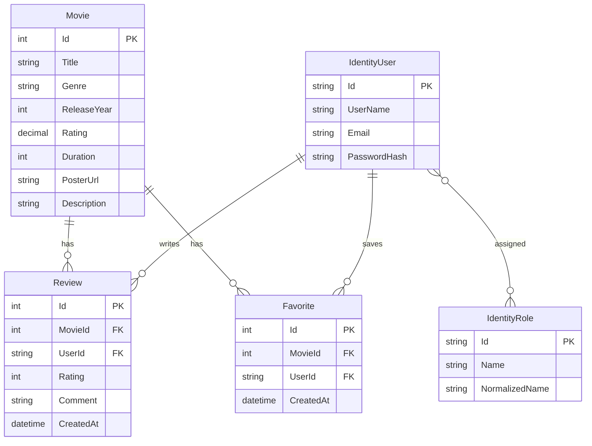

# CineScope ER Diagram

This document explains the main database entities used by CineScope.

## Entity Overview

## Entities

### Movie

`Movie` is the central catalog entity. It stores the movie title, genre, release year, rating, duration, poster URL, and description. Movies can be created manually by Admin users or imported from TMDB.

Relationships:

- One movie can have many reviews.
- One movie can be saved as favorite by many users.

### Review

`Review` stores member feedback for a movie. Each review belongs to one movie and one Identity user.

Important fields:

- `MovieId` links the review to a movie.
- `UserId` links the review to the member who wrote it.
- `Rating` stores a 1-10 user rating.
- `Comment` stores the review text.
- `CreatedAt` stores when the review was created.

### Favorite

`Favorite` stores a member's saved movie. Each favorite belongs to one movie and one user.

Important fields:

- `MovieId` links the favorite to a movie.
- `UserId` links the favorite to the member.
- `CreatedAt` stores when the movie was saved.

A unique index prevents the same user from saving the same movie more than once.

### IdentityUser

`IdentityUser` is provided by ASP.NET Core Identity. It stores account information such as user name, email, password hash, and security metadata.

In CineScope, users can be:

- Guest: not stored as a logged-in account.
- Member: registered account.
- Admin: seeded account with the Admin role.

### IdentityRole

`IdentityRole` is provided by ASP.NET Core Identity. It stores role records such as `Admin` and `Member`.

ASP.NET Identity also creates join tables such as `AspNetUserRoles`, which connect users to roles.
