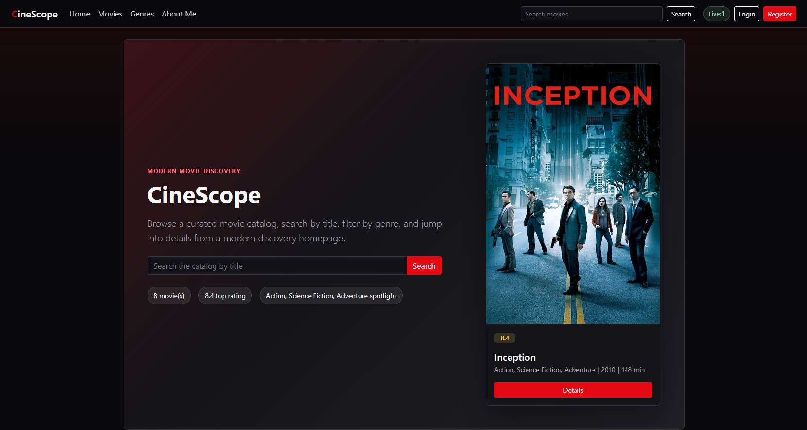
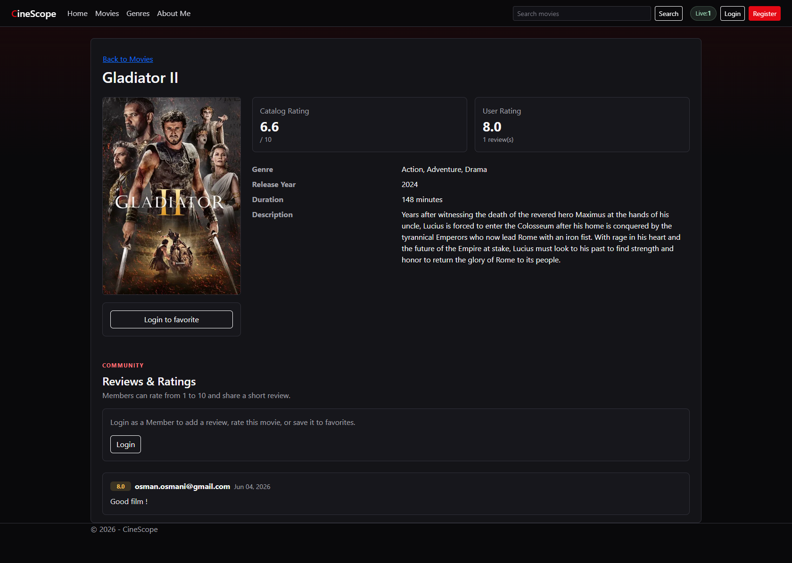
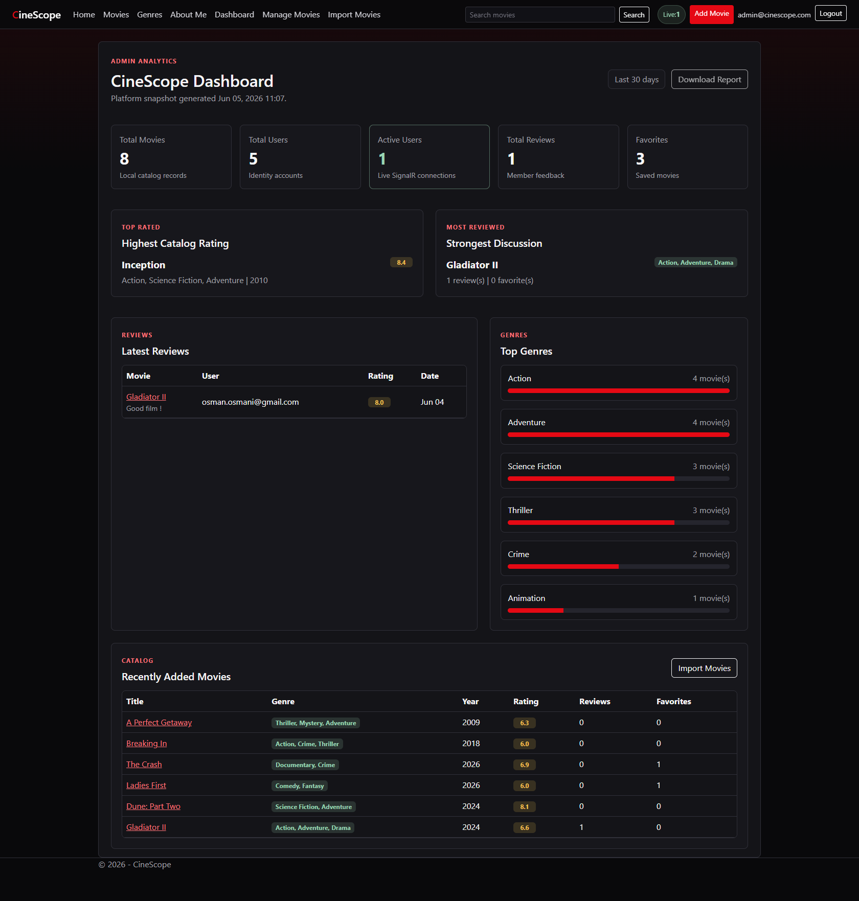
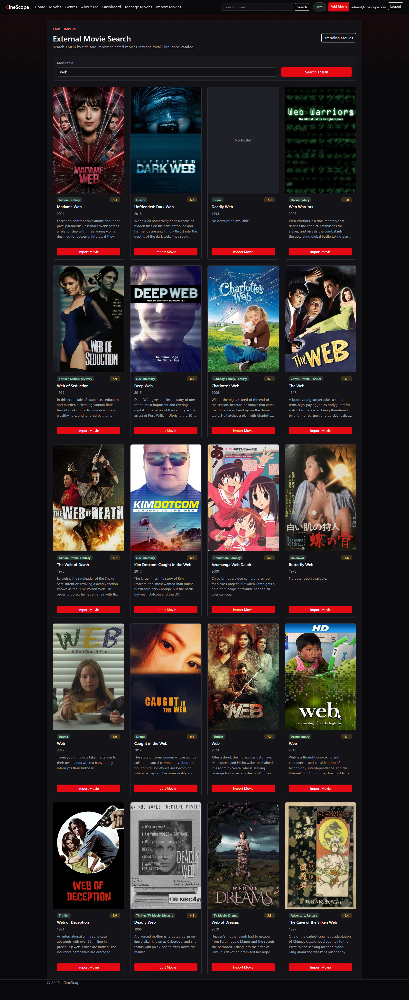
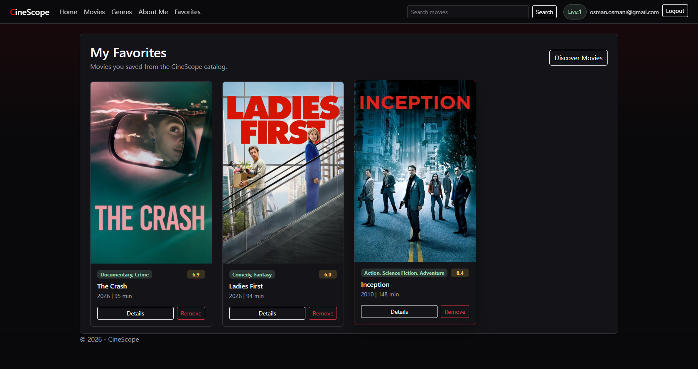
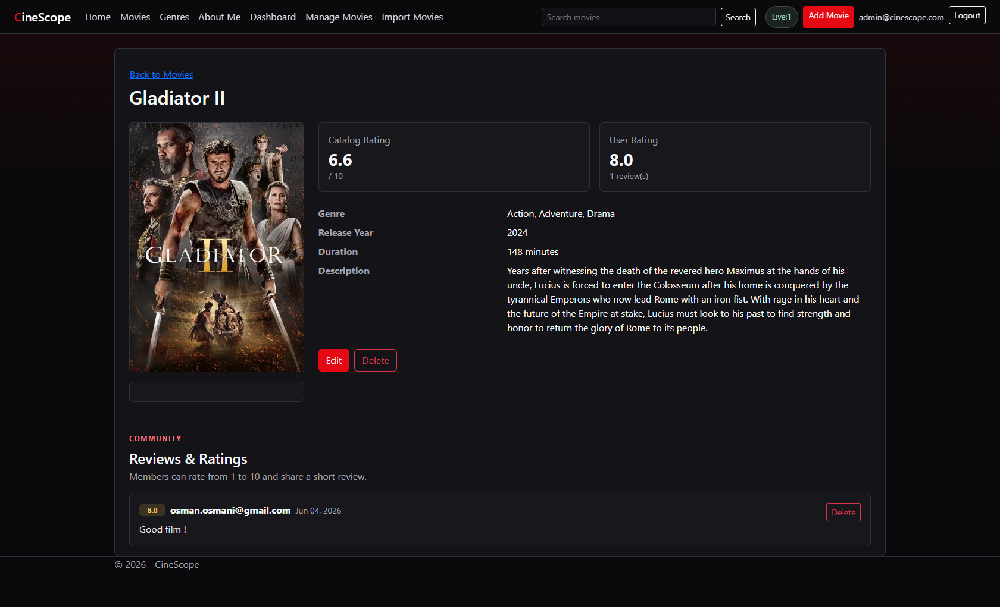
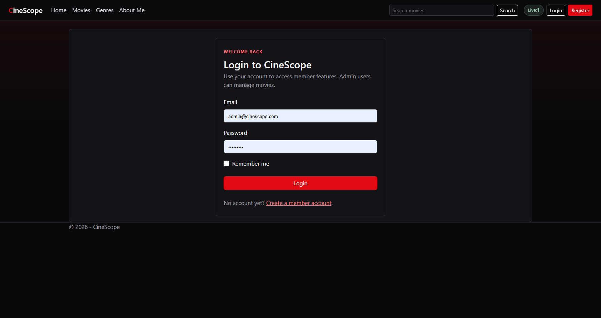
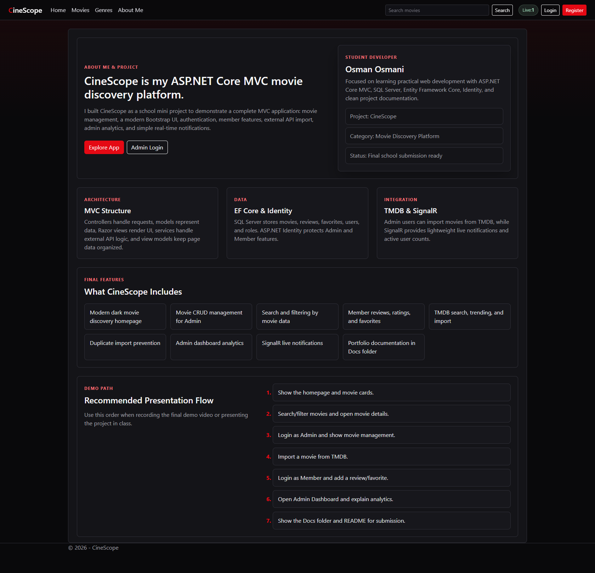

# CineScope - Modern Movie Discovery Platform

CineScope is a school mini project and portfolio-ready ASP.NET Core MVC application for discovering, managing, reviewing, and importing movies. It started as a basic CRUD movie management system and was extended step by step with a modern UI, authentication, roles, reviews, favorites, external API import, admin analytics, and simple real-time notifications.

## Tech Stack

- ASP.NET Core MVC
- SQL Server LocalDB / SQL Server
- Entity Framework Core
- Razor Views
- Bootstrap 5
- ASP.NET Core Identity
- Role-based authorization
- TMDB external movie API
- SignalR for simple real-time notifications

## Features

- Modern dark movie discovery homepage
- Movie CRUD management
- Search movies by title
- Filter movies by genre and release year
- Movie details page with poster, metadata, reviews, ratings, and favorites
- Member reviews and 1-10 ratings
- Member favorites page
- Admin-only movie create, edit, delete
- Admin-only TMDB movie search and trending import
- Duplicate import prevention by movie title and release year
- Admin analytics dashboard
- Latest reviews, active users, top genres, top-rated movie, most reviewed movie, recent movies
- Simple SignalR active users indicator and toast notifications

## User Roles

### Guest

- Browse the homepage
- Search and filter movies
- View movie details
- Cannot add reviews, ratings, favorites, or manage movies

### Member

- All Guest permissions
- Add reviews and ratings
- Add/remove favorites
- View personal favorites page

### Admin

- All catalog browsing features
- Create, edit, and delete movies
- Import movies from TMDB
- Delete inappropriate reviews
- View admin dashboard analytics

## Default Admin Login

```text
Email: admin@cinescope.com
Password: Admin123!
```

The Admin user and roles are created automatically by `IdentitySeeder` when the app starts.

## Run Locally

Prerequisites:

- .NET SDK installed
- SQL Server LocalDB or SQL Server
- EF Core tools installed

Commands:

```powershell
dotnet restore
dotnet build
dotnet ef database update
dotnet run --urls http://localhost:5270
```

Open:

```text
http://localhost:5270
```

## Database Migrations

Existing migrations:

- `InitialCreate`
- `AddIdentityRoles`
- `AddReviewsFavorites`

Apply migrations:

```powershell
dotnet ef database update
```

Create a new migration after model changes:

```powershell
dotnet ef migrations add MigrationName
dotnet ef database update
```

## TMDB API Integration

CineScope uses TMDB for:

- Searching external movies by title
- Viewing trending movies
- Importing selected movies into the local database

The API settings are stored in `appsettings.json`:

```json
"Tmdb": {
  "ApiKey": "",
  "BaseUrl": "https://api.themoviedb.org/3",
  "ImageBaseUrl": "https://image.tmdb.org/t/p/w500",
  "Language": "en-US"
}
```

For local development, store the API key using user secrets instead of committing it:

```powershell
dotnet user-secrets init
dotnet user-secrets set "Tmdb:ApiKey" "YOUR_TMDB_API_KEY"
```

Do not commit real API keys to GitHub.

## Screenshots

The screenshots below show the main CineScope pages for the final school submission.

### Homepage



### Movie Details



### Admin Dashboard



### TMDB Import



### Favorites



### Movie Management



### Login



### About Me



## Project Structure

```text
CineScope/
  Controllers/
  Data/
  Docs/
  Hubs/
  Migrations/
  Models/
  Services/
  ViewModels/
  Views/
  wwwroot/
```

## Important Pages

- `/` - Discover homepage
- `/Movies` - Movie management/listing
- `/Movies/Details/{id}` - Movie details
- `/Favorites` - Member favorites
- `/Movies/AboutMe` - About Me and project overview
- `/ExternalMovies/Search` - Admin TMDB search
- `/ExternalMovies/Trending` - Admin trending movies
- `/Admin` - Admin dashboard

## Deployment Notes

For Azure App Service:

1. Create an Azure App Service.
2. Create an Azure SQL Database.
3. Set the production connection string in Azure App Service Configuration.
4. Set `Tmdb:ApiKey` as an App Service application setting.
5. Publish from Visual Studio or a GitHub Actions workflow.
6. Run EF Core migrations against the production database.

See `Docs/Deployment-Guide.md` for details.

## Future Improvements

- Better review moderation tools
- User profile pages
- Pagination for movies and reviews
- More advanced analytics charts
- Azure Key Vault for secrets
- Automated CI/CD pipeline
- Docker container deployment
- Unit and integration tests
